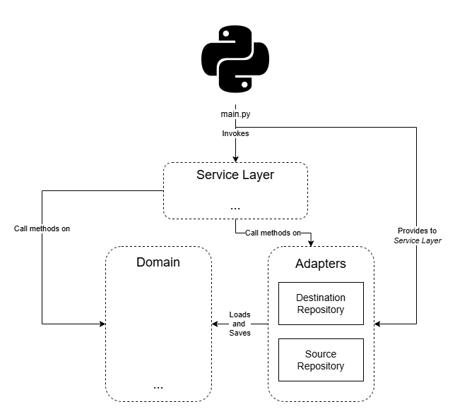

# Template Python Devcontainer

A template repository for Python projects using a preconfigured Dev Container environment.


## Features

- **Development Environment**: Pre-configured development container for consistent setup.
- **Comprehensive Testing**: Includes pre-configured unit tests and integration tests to ensure code reliability, along with test coverage reporting.
- **Pipeline Integration**: Automated pipelines to unit test python solution.

## Development environment

Recommended development enviroment is VSCode Dev Containers extension. The configuration and set up of this dev container is already defined in `.devcontainer/devcontainer.json` so setting up a new containerised dev environment on your machine is straight-forward.

Pre-requisites:
- docker installed on your machine and available on your `PATH`
- [Visual Studio Code](https://code.visualstudio.com/) (VSCode) installed on your machine
- [Dev Containers](https://marketplace.visualstudio.com/items?itemName=ms-vscode-remote.remote-containers) vscode extension installed

Steps:
- In VSCode go to `View -> Command Pallet` and search for the command `>Dev Containers: Rebuild and Reopen in Container`

The first time you open the workspace within the container it'll take a few minutes to build the container, setup the virtual env and then login to gcloud. At the end of this process you will be presented with a url and asked to provide an authorization. Simply follow the url, permit the access and copy the auth code provided at the end back into to the terminal and press enter. 

### Configure Git 

For seamless Git usage in a Dev Container, create a local script at .devcontainer/git_config.sh (do not push this file to the repository) and set your GitHub account name and email:

```bash
#!/bin/bash

git config --global user.name "your github account name"
git config --global user.email "your github account email"
```

### Local Execution

Local execution is enhanced by the use of the Python library `Click`, which allows the creation of Command Line Interfaces. To execute the solution locally, run the command {`indicate-cli-bin-file-name`} in a Bash terminal inside the devcontainer. This command will display a message listing the available arguments for performing different actions. You can explore additional details and options by using the `--help` flag.

you need to provide a `.env` file at project root location with the following data:

```ini
{includes env vars required}
```

### Unit tests

To execute tests, provide a `tests/.env` file with the following data:

```ini
{includes env vars required}
```

To run the tests, execute the following command in terminal:

```bash
python -m pytest -vv --cov --cov-report=html
```

Unit testing has been integrated into the CI/CD pipeline. A merge will not be approved unless all tests pass successfully. Additionally, a coverage report is automatically generated and provided as a comment for reference. A Service Account granted with role {`list_required_roles`} is required. Current workflow, `.github/workflows/pytest.yaml`, is set to access GCP Project through Workload Identity Provider.

## Component Diagram

The code architecture of the Python solution is illustrated below. We adopt Onion/Clean Architecture, so ensuring that our Business Logic (Domain Model) has no dependencies. Our goal is to follow SOLID principles, promoting seamless future changes and enhancing code clarity.

The `{path-to-main-file}` file is used by the deployed solution as entrypoint, as required by {indicate infrastructure used}. Locally, as described in the "Local Execution" section, code execution starts from the Python entrypoint located at `src/entrypoints/cli/__main__.py`. This entrypoint is invoked using the command {`indicate-cli-bin-file-name`} in a Bash terminal. 

Several entry points can be provided seamlessly because, following Clean Architecture principles, the `main.py` function is treated as the last detail. This ensures that none of the core solution code depends on the entry point; instead, the entry point depends on the core solution code. This design promotes flexibility and allows for the easy addition of new entry points without impacting the existing architecture. Which, in turn, means that the source is independent of the infrastructure. 

The Python entrypoint invokes one of the services found in `src/services.py`. {Include small description of current services}. This service receive objects of the clients for both the destination repository and the source repository as parameters.

The services handle the execution by calling methods found in the Domain and Adapters to ensure the successful completion of the process.

<p align="center">
    
</p>

The clients for data storage have been implemented following the Repository pattern. This design pattern abstracts the logic for retrieving and storing data, providing a higher-level interface to the rest of the application. By doing so, it enables the implementation of the Dependency Inversion Principle (DIP). This approach allows our Database Layer (Adapters) to depend on the Domain Model, rather than the other way around. This, in turn, facilitates the seamless use of the same Business Logic/Domain Model in another scenario with a different Infrastructure/Data Layer.

Related code can be found on `src/destination_repository.py` and `src/source_repository.py`.

{Include adapters diagram}
<!-- <p align="center">
    
</p> -->

In the picture above you can also find the Domain Model diagram representing the code found in `src/model` folder. Circles are value objects and rectangles are entities.

## CI/CD - Pipeline Integration
There are 2 CI/CD pipelines implemented as GitHub Actions:

1. **Pytest**: This pipeline is defined in the `.github/workflows/pytest.yaml` file. It is triggered on every pull request, what runs unit tests using `pytest`. It also generates a test coverage report to ensure code quality. If any test fails, the pipeline will block the merge process, ensuring that only reliable code is integrated into the main branch. Finally, the pipeline requiress a pytest coverage over a given threshold. A Service Account granted with role {`list_required_roles`} is required. Current workflow, `.github/workflows/pytest.yaml`, is set to access GCP Project through Workload Identity Provider.

2. **Deployment**: The deployment process is managed through two GitHub Actions workflows. The first workflow, `.github/workflows/terraform-validate.yaml`, validates the Terraform code and generates a deployment plan during a pull request, blocking merge in case of failures. The second workflow, `.github/workflows/terraform-apply.yaml`, executes after a merge to deploy the changes to Google Cloud Platform (GCP).

## Deployment implementation

The Terraform code in this repository automates the deployment of the {`indicate-solution-name`} as {`indicate infrastructure implementation`}. It provisions and configures the necessary resources to ensure seamless ingestion and processing of data. 

The Terraform code automates the deployment process by managing the following components:

{`Indicate components recruited`}

### Considerations

The Terraform code is designed to be executed by the workflows defined in `.github/workflows/terraform-validate.yaml` and `.github/workflows/terraform-apply.yaml`. 

The backend for this solution is configured to reside in Google Cloud Storage (GCS). If you plan to reuse this code, ensure you update the backend bucket name accordingly.

### Prerequisites for Terraform Execution

Before the Terraform code can be executed, ensure the following:

1. **Cloud Function Service Account**:
    - Provide a Service Account for the {infrastructure name} with the following roles:
      - {`indicate-roles-required`}

2. **Terraform Execution Permissions**:
    - Either your user account or the Service Account used to run the Terraform code must have the following roles:
      - {`indicate-roles-required`}

To reuse the GitHub Action, follow these steps:

1. **Create a Workload Identity Provider (WIP):**  
   This enables keyless authentication for GitHub Actions.  
   - [Learn why this is needed](https://cloud.google.com/blog/products/identity-security/enabling-keyless-authentication-from-github-actions).  
   - [Follow these instructions](https://docs.github.com/en/actions/security-for-github-actions/security-hardening-your-deployments/configuring-openid-connect-in-google-cloud-platform).

2. **Set up Service Account:**  
   - Grant the Terraform Executor Service Account the necessary permissions to execute Terraform code as indicated before.
   - Assign the role `roles/iam.workloadIdentityUser`.
   - Set the Service Account as the principal for the Workload Identity Provider created in step 1.

3. **Provide secrets:**
    - `WORKLOAD_IDENTITY_PROVIDER` & `SERVICE_ACCOUNT_EMAIL` must be provided as Github Actions Secrets.


# Reuse template

You need to modify the following files to adapt the template to your specific project:

1. **`.devcontainer/devcontainer.json`**:  
    - Update the `name` field from `template-python-devcontainer` to your repository name or preferred identifier.  
    - Adjust the `PATH` and `PYTHONPATH` in the `remoteEnv` section to reflect the new workspace name.

2. **`cli/bin/template-python-devcontainer`**:  
    - Modify the CLI activation file name to better represent the purpose of your solution.

3. **`.devcontainer/post_create_commands.sh`**:  
    - Update lines 4 to 6 to reflect the new CLI command name and workspace name.

4. **GitHub Workflows**:  
    - In all workflow files (e.g., `.github/workflows/pytest.yaml`, `.github/workflows/terraform-validate.yaml`, `.github/workflows/terraform-apply.yaml`), modify the `on` clause to allow execution on the `main` branch.

5. **`main.tf`**:  
    - Update the Terraform backend configuration to use the correct Google Cloud Storage (GCS) bucket name and path to locate tfstate files.

6. **Source Code**:  
    - Adjust the source code as necessary to align with your project's requirements. Refer to the provided small examples for guidance.
    - Update requirements.txt as required.

By following these steps, you can customize the template to suit your project's needs.
